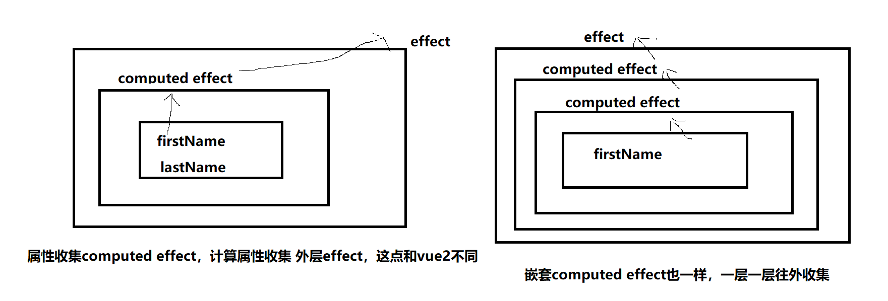

├─packages             # 项目源代码包管理
├─scripts              # 打包配置


##### 响应式原理 
###### 核心 effect effect 对应多个属性，一个属性对应多个effect 多对多关系 （vue2 watcher和dep 关系类似）
```
  - 1.effect（核心）创建实例化ReactiveEffect，_effect.run默认执行，同时设置全局的activeEffect
  - 2.new Proxy对象进行代理
    - get方法进行依赖收集track）
      - track 中进行依赖收集，创建一个WeakMap对象（WeakMap = {对象:Map{name:Set}}）
        - 对象：当前对象
        - name：当前读取的属性
        - Set：当前属性对应的effect集合
    - set方法进行更新，将当前属性记录的effect取出执行
```

#### computed
######  核心：effect + 缓存 + 收集


```
  思路：
  - 1.computed函数，入参（函数or对象），如果是函数那么getter就是该函数,否则对应对象的get 和 set;
  - 2.computed函数默认实例化 ComputedRefImpl：
    - ComputedRefImpl默认实例化了一个ReactiveEffect，但是全局的`activeEffect`还是null，只有执行ReactiveEffect的run方法才会设置`activeEffect`;
    - 通过xxx.value 获取计算属性的值会触发 get value(){}方法
      - 首先进行依赖收集（收集外层的effect或者嵌套的computed）
      - 接着判断是否是脏值（dirty默认脏值），如果是脏值则调用effect.run()重新计算值，否则直接返回值
        - effect.run()会触发属性的get方法,触发track，创建一个WeakMap对象（WeakMap = {对象:Map{name:Set}}），属性 记录当前的计算属性的ReactiveEffect，同时计算属性反向记录dep（即WeakMap中Set）
  - 3.如果计算属性依赖属性变化，会触发属性的set方法，查找对应计算属性的effect，找到effect全部执行，然后计算属性执行triggerEffects（如果外层还有收集的effect或者computed那就接着执行）
```

#### watch
###### 核心：effect + 收集
```
  watch(sources,cb,options)函数
    - sources：不管是对象还是函数 getter 最终是 ()=>sources 
      - 对象：如果是对象，那么调用traverse递归遍历对象上的属性，触发属性的get方法进行依赖收集
      - 函数：会在首次oldValue = effect.run()执行的时候，执行该函数，从而触发属性的get方法进行依赖收集
    - cb：函数的回调
    - options：配置项
  思路：
    - 1.传入sources参数，判断是对象还是函数，最终赋值给变量getter（不管是对象还是函数 getter 最终是 ()=>sources）
    - 2.创建watch的effect（ReactiveEffect(getter,job)），并首次调用一次effect.run，执行getter，如果sources是函数，那么监听的属性是在这里触发get从而进行收集当前的watch effect
    - 3.创建job函数，作为effect的调度函数，当属性变化的时候，触发属性get，调用trigger方法，去查找对应的effect，找到了watch 的effect并执行，执行调度函数（即创建watch effect是传入的job）
    - 4.创建onCleanup副作用函数，放入job函数中，当下次watch触发的时候，执行一次
```
